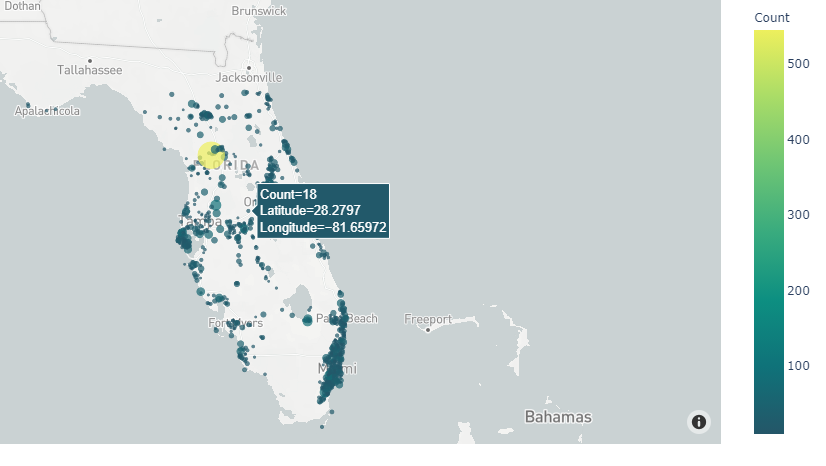

<h1 align= "center">Heatmaps using HDBSCAN Clustering</h1>

Using Florida Property Insurance data to identify red hot and cold blue areas for potential targeting. Clustering is performed to segregate data points into a number of clusters based on areas such that data points in the same area are in close proximity to other data points in the same area than those in other areas. In simple words, the aim is to segregate groups with similar traits and assign them into clusters.

# HDBSCAN Clustering
HDBSCAN - Hierarchical Density-Based Spatial Clustering of Applications with Noise. Performs DBSCAN over varying epsilon values and integrates the result to find a clustering that gives the best stability over epsilon. This allows HDBSCAN to find clusters of varying densities (unlike DBSCAN), and be more robust to parameter selection.

In practice this means that HDBSCAN returns a good clustering straight away with little or no parameter tuning -- and the primary parameter, minimum cluster size, is intuitive and easy to select.

# Florida Heatmap using HDBSCAN Clustering and Basemap
To view the output "Florida Heatmap" click on To view this file go to 
https://shloksethia-6119.github.io/Clustering-Heatmap/Heatmaps/florida_heatmap.html

Clearly, Miami is the hotspot for Property Insurance as seen above. To get a better picture we focus on Miami and generate a focused heatmap.
To view the output "Miami Heatmap" click on To view this file go to 
https://shloksethia-6119.github.io/Clustering-Heatmap/Heatmaps/miami_heatmap.html

